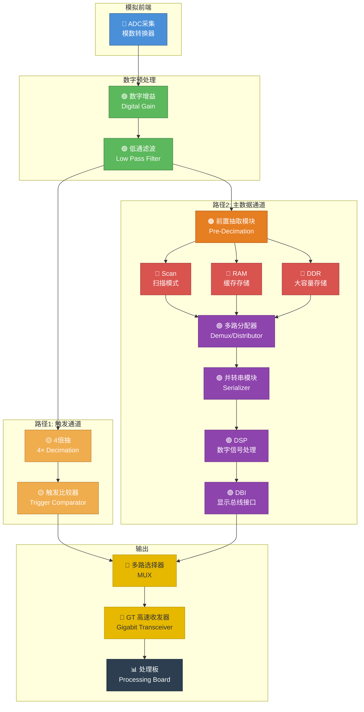

## 一、采集板整体架构概述

示波器采集板的核心任务是：将模拟信号数字化，然后通过不同的数据路径（触发路径与存储/显示路径），最终将波形数据传输到处理板进行显示和分析。

整体数据流如下：

```
ADC采集 → 数字增益 → 低通滤波 → ┬─ 路径1（触发路径）：4倍抽 → 触发比较器 ─┐
                                  │                                        │
                                  └─ 路径2（主数据路径）：前置抽取 → ... → ─┤
                                                                           │
                                                        多路选择器 → GT → 处理板
```

---

## 二、架构框图（Mermaid 流程图）



---

## 三、各模块功能详解

### 1. ADC 采集（模数转换器）

| 属性 | 说明 |
|------|------|
| **作用** | 将模拟输入信号转换为数字信号 |
| **核心指标** | 采样率（如 5GSa/s）、分辨率（如 8/10/12 bit）、模拟带宽 |
| **输入** | 外部模拟信号（经过前端调理/衰减） |
| **输出** | 高速并行数字数据流 |

ADC 是整个采集链路的起点。采样率决定示波器的实时带宽（根据奈奎斯特定理，采样率至少为信号最高频率的 2 倍，实际工程中通常需要 5~10 倍）。分辨率则直接影响垂直精度。

---

### 2. 数字增益（Digital Gain）

| 属性 | 说明 |
|------|------|
| **作用** | 对 ADC 输出数据进行数字域幅度调整（放大或缩小） |
| **原理** | 通过乘法器，将数字值乘以一个增益系数 |
| **目的** | 配合模拟前端的衰减/放大，实现垂直灵敏度档位切换（V/div），同时补偿 ADC 量化误差 |

在示波器中，用户切换垂直档位（如从 1V/div 切换到 100mV/div）时，模拟前端会先做粗调，数字增益再做精细调整，确保波形在屏幕上显示合适的幅度。

---

### 3. 低通滤波（Low Pass Filter）

| 属性 | 说明 |
|------|------|
| **作用** | 滤除高频噪声和不需要的频率分量 |
| **原理** | FIR/IIR 数字滤波器，保留低频成分，衰减高频成分 |
| **目的** | 提升信噪比（SNR）、防止混叠、配合等效采样实现带宽限制 |

这一步通常在数字域完成后，滤除了带外噪声，为后续的抽取（Decimation）和触发检测提供干净的数据。

---

### 🚩 分岔点对照表

| | 路径 1（触发路径） | 路径 2（主数据路径） |
|---|---|---|
| **目的** | 实时检测触发事件 | 存储、处理、显示波形数据 |
| **延迟要求** | 极低延迟 | 允许较高延迟 |
| **数据量** | 仅需判断触发条件 | 需要完整波形数据 |
| **处理重点** | 比较/判决 | 存储、抽取、DSP 处理 |

---

### 路径 1：触发通道

#### 4. 4 倍抽（4× Decimation）

| 属性 | 说明 |
|------|------|
| **作用** | 每 4 个采样点取 1 个，将数据速率降低 4 倍 |
| **目的** | 减少触发通道的数据吞吐量，降低触发比较器的处理压力 |
| **原理** | 抽样（抽取因子 = 4），等价于将采样率降低为原来的 1/4 |

触发检测不需要全分辨率数据。通过 4 倍抽取，数据率大幅下降，后续比较器可以在较低频率下可靠工作，同时功耗和资源占用也更低。

---

#### 5. 触发比较器（Trigger Comparator）

| 属性 | 说明 |
|------|------|
| **作用** | 将抽取后的数据与用户设置的触发电平进行比较 |
| **核心功能** | 检测上升沿、下降沿、脉冲宽度、斜率等触发条件 |
| **输出** | 触发标志信号（Trigger Flag），指示触发事件发生的时间和位置 |

这是示波器最核心的功能模块之一。比较器不停地监控信号是否越过设定的触发电平，一旦满足触发条件（边沿类型、电平值），就产生触发信号，用于锁定波形显示的时间基准。

---

### 路径 2：主数据通道

#### 6. 前置抽取模块（Pre-Decimation）

| 属性 | 说明 |
|------|------|
| **作用** | 根据当前时基档位（Time/div），对数据流进行适当比例的抽取 |
| **原理** | 大时基（慢扫描）时抽取更多，小时基（快扫描）时抽取更少或不做抽取 |
| **目的** | 使数据率匹配后级存储带宽和显示分辨率 |

例如：采样率 5GSa/s，屏幕水平 1000 点，时基 1μs/div（10μs 全屏），需要 50,000 个点。如果不抽取，10μs 内会有 50,000 个点正好匹配；但如果时基是 1ms/div（10ms 全屏），会有 50,000,000 个点，就需要大量抽取才能在屏幕上显示。

---

##### 前置抽取下面的三条子路径：

| 子路径 | 全称 | 作用 | 特点 |
|--------|------|------|------|
| **Scan** | 扫描模式 | 实现滚动显示（类似心电监护仪） | 实时连续刷新，低延迟，用于慢速信号观察 |
| **RAM** | 随机存取存储器 | 将数据存入 FPGA 内部 Block RAM | 快速缓存，容量较小（KB~MB 级），用于短时捕获 |
| **DDR** | 双倍数据率内存 | 将数据存入外部 DDR SDRAM | 大容量（GB 级），用于深存储、分段存储、历史波形回放 |

三者的分工：
- **Scan 模式**：时基较慢时（如 >100ms/div），数据实时滚动显示，不需要大容量存储。
- **RAM**：正常模式下快速触发捕获，RAM 作为环形缓冲区，一旦触发事件发生，冻结 RAM 内容供读出。
- **DDR**：需要深存储（如 100Mpts）时，内部 RAM 装不下，需要外部 DDR 内存来存储超长波形记录。

---

#### 7. 多路分配器（Demux / Distributor）

| 属性 | 说明 |
|------|------|
| **作用** | 将 scan / ram / ddr 三条路径的数据汇总并选择当前需要输出的那一路 |
| **控制信号** | 根据当前工作模式（扫描/正常/深存储）决定选通哪条路径 |

注意：这里叫"多路分配器"但实际上是起到了**选择器**的作用（从多路中选一路）。它是一个 3 选 1 的开关，决定最终哪条路径的数据进入后续处理。

---

#### 8. 并转串模块（Serializer / Parallel-to-Serial）

| 属性 | 说明 |
|------|------|
| **作用** | 将并行数据转换为串行数据 |
| **原因** | FPGA 内部处理通常使用宽并行总线（如 128bit @ 156.25MHz），但高速传输需要串行 |
| **目的** | 降低引脚数、提高传输速率、适配 GT 串行收发器 |

例如：内部 64bit 并行 @ 250MHz = 16Gbps，转换成 1bit 串行 @ 16Gbps 通过 GT 发送。

---

#### 9. DSP（数字信号处理）

| 属性 | 说明 |
|------|------|
| **作用** | 对波形数据进行数学运算和处理 |
| **典型功能** | 数字滤波、FFT 频谱分析、数学运算（加减乘除）、插值（sinx/x）、平均/峰值检测 |
| **实现方式** | FPGA 内的 DSP48/DSP Slice 硬核单元 |

常见 DSP 处理包括：
- **插值**：当抽取后点数不足时，通过插值平滑波形
- **峰值检测**：确保抽取时不丢失窄脉冲信息
- **平均**：多次采集求平均，抑制随机噪声
- **FFT**：频域分析

---

#### 10. DBI（Display Bus Interface / 显示总线接口）

| 属性 | 说明 |
|------|------|
| **作用** | 将处理后的数据打包成适合传输和显示的格式 |
| **功能** | 波形数据打包、添加帧头帧尾、可能包含坐标映射信息 |
| **输出** | 标准化的数据包/帧，通过 GT 发送到处理板 |

DBI 负责将 FPGA 内部处理好的裸数据封装成协议帧，处理板收到后可以直接解析并驱动屏幕显示。

---

### 输出与传输

#### 11. 多路选择器（MUX）

| 属性 | 说明 |
|------|------|
| **作用** | 选择触发路径（路径 1）或主数据路径（路径 2）的输出送往 GT |
| **仲裁逻辑** | 通常情况下主数据路径输出波形数据；触发路径在需要时传递触发信息或快速预览数据 |
| **功能** | 2 选 1 开关 |

两条路径在此交汇：正常情况下主数据通道输出完整的波形数据包，触发路径只在特定场景（如触发位置标记、快速触发预览）下才会被选通。

---

#### 12. GT（Gigabit Transceiver / 高速串行收发器）

| 属性 | 说明 |
|------|------|
| **作用** | 高速串行数据发送（如 Xilinx GTP/GTX/GTH） |
| **速率** | 通常数 Gbps ~ 数十 Gbps（如 10.3125Gbps、25Gbps） |
| **物理接口** | 通过光纤或高速差分线（如 SMA/SFP）连接到处理板 |

GT 是数据从采集板到处理板的高速桥梁。由于示波器采集板的瞬时数据率极高（例如 5GSa/s × 10bit = 50Gbps），必须使用多通道 GT 才能将数据实时传输出去。

---

#### 13. 处理板（Processing Board）

| 属性 | 说明 |
|------|------|
| **作用** | 接收并解析 GT 传来的数据，完成最终显示和用户交互 |
| **核心组件** | 主控 CPU/SoC、GPU、显示驱动 |
| **功能** | 波形渲染、测量统计、用户界面、远程控制等 |

处理板通常是嵌入式 ARM/x86 平台 + Linux，运行示波器应用软件，负责将收到的波形数据在屏幕上绘制出来，并响应用户的旋钮/按键/触摸操作。

---

## 四、数据流速览总结

```
┌─────────────────────────────────────────────────────────┐
│                    采集板 (Acquisition Board)             │
│                                                         │
│  模拟信号 ──► [ADC] ──► [数字增益] ──► [低通滤波]          │
│                                          │              │
│                    ┌─────────────────────┤              │
│                    ▼                     ▼              │
│              [4倍抽取]             [前置抽取]             │
│                    │                /  |  \              │
│                    ▼             scan ram ddr            │
│              [触发比较器]            \  |  /              │
│                    │              [多路分配器]            │
│                    │                  │                  │
│                    │            [并转串模块]              │
│                    │                  │                  │
│                    │              [DSP]                  │
│                    │                  │                  │
│                    │              [DBI]                  │
│                    │                  │                  │
│                    └──────┬───────────┘                  │
│                           ▼                              │
│                     [多路选择器]                          │
│                           │                              │
│                           ▼                              │
│                     [GT 高速收发]                         │
│                           │                              │
└───────────────────────────┼──────────────────────────────┘
                            │ 光纤 / 高速差分
                            ▼
┌─────────────────────────────────────────────────────────┐
│                    处理板 (Processing Board)              │
│                                                         │
│              [GT 接收] ──► [波形渲染] ──► [屏幕显示]       │
│                                                         │
└─────────────────────────────────────────────────────────┘
```

---

## 五、关键设计要点

1. **双路径架构的价值**：触发路径和主数据路径分离，确保触发检测的低延迟与数据存储的高带宽互不干扰。
2. **多级抽取**：不同的时基档位需要不同的抽取比，前置抽取 + 4 倍抽的级联设计实现了灵活的抽样策略。
3. **三种存储模式**：Scan（实时滚动）、RAM（快速触发捕获）、DDR（深存储），覆盖了从实时浏览到深度分析的各类应用场景。
4. **GT 高速传输**：采集板到处理板之间的带宽瓶颈通过 GT 解决，多 lane 绑定可达到 >100Gbps 的总带宽。