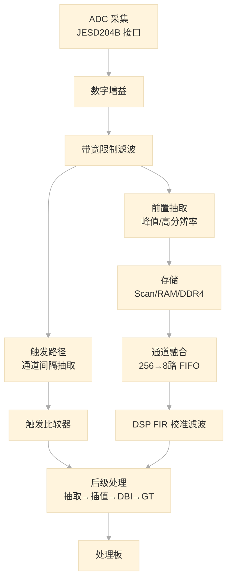

## 一、系统层次

系统为三层架构：

- **采集板（ACQ）**：接收 ADC 数据，触发检测，数据存储与预处理，GT 发送
- **处理板（PRO）**：也是 FPGA 板。汇聚多块采集板数据，DSP 处理，触发决策，波形绘制，PCIe 发送
- **PC 上位机**：软件显示与交互

本文介绍采集板的数据通路与核心模块。

---

## 二、整体数据流

数据从 ADC 进来后分叉为两条路径：

| | 触发路径 | 主数据路径 |
|---|---|---|
| **目的** | 实时检测触发事件 | 存储、处理、传输完整波形 |
| **延迟要求** | 极低 | 允许较高延迟 |
| **数据量** | 仅需判断触发条件 | 需要完整波形数据 |

---

## 三、核心模块

### 1. ADC 与 JESD204B 接口

高速 ADC 与 FPGA 之间采用 **JESD204B 协议**进行数据传输，这是一种高速串行接口标准，每对差分线速率可达 10Gbps 以上。数据被编码成帧后通过 SerDes Lane 传输，FPGA 端使用 GTY 高速收发器硬核接收，配合 JESD204B IP 核完成帧解码，恢复为并行数据。

JESD204B 取代了传统并行 LVDS 接口，优势在于引脚数少、速率高、无需处理多路数据线间的时序偏移。

### 2. 数字增益与带宽滤波

数字增益对 ADC 输出进行幅度缩放，配合模拟前端实现垂直灵敏度档位切换。带宽限制滤波为 FIR 低通滤波器，滤除高频噪声，防止后续抽取时的频谱混叠。

### 3. 触发比较器——示波器的核心

触发路径先做通道间隔抽取（256 路取 1/4 为 64 路，降低数据量），送入触发比较器。比较器将数据与触发电平比较，检测上升沿/下降沿，产生触发标志。

**触发是示波器最核心的机制**。信号以 GSa/s 速率涌入，屏幕只刷几十 Hz。触发通过锁定信号的特定相位，保证每帧波形起始位置一致，使显示稳定不滚动。

频率计也挂接在此处，利用边沿计数配合闸门时间计算信号频率。

### 4. 前置抽取与存储

根据时基档位对数据流进行抽取，使数据率匹配存储带宽。两种关键模式：

- **峰值检测（Peak Detection）**：取区间内最大/最小值——即使大量抽取也不丢失窄脉冲。这是示波器区别于普通 ADC 采集卡的核心特征。
- **高分辨率（Hi-Res）**：取平均值，提高有效位数。

抽取后三条子路径：Scan（滚动显示，不存储）、RAM（FPGA 内部环形缓冲，短时基触发捕获）、DDR4（外部深存储，GB 级，长时基和分段存储）。

### 5. 通道融合（256→8 路 FIFO）与跨时钟域

异步 FIFO 将 256 路宽并行数据压缩为 8 路，同时从 ADC 时钟域切换到系统时钟域。这是关键的**跨时钟域（CDC）处理**——多 bit 数据跨时钟域的标准方案就是异步 FIFO。

### 6. DSP FIR 校准滤波——TIADC 校准

复系数 FIR 滤波器，用于 **TIADC（时间交织 ADC）通道失配校准**。TIADC 用多颗 ADC 交替采样来提高等效采样率，但各通道间存在增益/偏移/时钟偏斜误差。FIR 滤波器在线更新校准系数，消除拼合波形的杂散谱。

### 7. IFIR 精细插值

非整数倍插值滤波器，在原始采样点间插入估算点（等效 sin(x)/x 插值）。小时基档位下采样点不足时，IFIR 使波形显示平滑。

### 8. DBI 与 GT 高速发送

**DBI** 负责 2x/4x 插值、DUC（数字上变频）和数据打包成帧。注意这里的 DBI 指 Digital Bandwidth Interpolation，**不是** Digital Bandwidth Interleaving（多颗低速 ADC 频域拼接技术）。

**GT 收发器**内部含 PCS（8b/10b 编码）和 PMA（串行化/解串），将并行数据转为串行 bit 流发往处理板。这才是真正完成并转串的模块。

---
