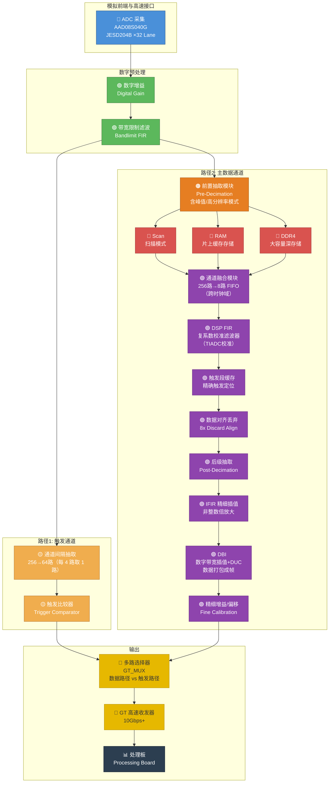

## 一、采集板整体架构概述

示波器采集板的核心任务是：通过 JESD204B 高速串行协议接收来自 ADC 的采样数据，将模拟信号数字化后，分为**触发路径**（实时检测触发条件）和**主数据路径**（存储/处理/传输波形数据），最终通过 GT 高速串行收发器将波形数据传输到处理板进行显示和分析。

采集板使用的 FPGA 型号为 **Xilinx VU9P**（Virtex UltraScale+），支持 32 对 JESD204B 数据通道（每对速率可达 10Gbps），外挂 4 片 DDR4 内存。

---

## 二、架构框图（Mermaid 流程图）



---

## 三、各模块功能详解

### 1. ADC 采集（模数转换器）

| 属性 | 说明 |
|------|------|
| **作用** | 将模拟输入信号转换为数字信号 |
| **ADC 型号** | AAD08S040G（8 位，高速 ADC） |
| **核心指标** | 采样率（~5GSa/s 级别）、分辨率（8/10/12 bit）、模拟带宽 |
| **输入** | 外部模拟信号（经过前端调理/衰减） |
| **输出** | 通过 **JESD204B 高速串行协议**（32 对差分线，每对 10Gbps+）传输到 FPGA |
| **FPGA 接收** | FPGA 内部使用 **GTY 高速收发器 + JESD204B IP 核**解码，将串行数据恢复为 256 路 × 8 位的并行数据 |

> **补充说明**：JESD204B 是现代高速 ADC 的标准接口协议。它不同于传统的并行 LVDS 接口，而是将数据编码后通过高速串行通道（SerDes Lane）传输。每对差分线的速率可达 10Gbps 以上。FPGA 需要专用的 GTY（Gigabit Transceiver）硬核和 JESD204B 协议 IP 核来接收解码。ADC 型号 AAD08S040G 通过 SPI 总线进行配置（时钟、参考电压等参数）。

---

### 2. 数字增益（Digital Gain）

| 属性 | 说明 |
|------|------|
| **作用** | 对 ADC 输出数据进行数字域幅度调整（放大或缩小） |
| **原理** | 通过乘法器，将数字值乘以一个增益系数（16 位定点数，含 11 位小数） |
| **目的** | 配合模拟前端的衰减/放大，实现垂直灵敏度档位切换（V/div），同时可补偿 ADC 各子通道间的增益不一致 |

在示波器中，用户切换垂直档位（如从 1V/div 切换到 100mV/div）时，模拟前端先做粗调，数字增益再做精细调整，确保波形在屏幕上显示合适的幅度。代码中通过 `reg_digital_gain_ch1_l16` 等寄存器配置增益系数。

---

### 3. 带宽限制滤波（Bandlimit FIR）

| 属性 | 说明 |
|------|------|
| **作用** | 滤除高频噪声和不需要的频率分量 |
| **原理** | FIR 数字滤波器（系数可通过寄存器在线配置），保留低频成分，衰减高频成分 |
| **目的** | 提升信噪比（SNR）、防止混叠、可配合不同带宽限制需求 |

这一步在数字域完成后，滤除了带外噪声，为后续的抽取（Decimation）和触发检测提供干净的数据。代码中通过 `ACQ_BANDWIDTH_EN` 宏控制是否使能，滤波器系数可通过 `reg_bandlimit_factor_h/l` 寄存器配置。

---

### 🚩 分岔点对照表

| | 路径 1（触发路径） | 路径 2（主数据路径） |
|---|---|---|
| **目的** | 实时检测触发事件 | 存储、处理、显示波形数据 |
| **延迟要求** | 极低延迟 | 允许较高延迟 |
| **数据量** | 仅需判断触发条件 | 需要完整波形数据 |
| **处理重点** | 比较/判决 | 存储、抽取、校准、插值、DSP 处理 |

---

### 路径 1：触发通道

#### 4. 通道间隔抽取（256 → 64 路）

| 属性 | 说明 |
|------|------|
| **作用** | 从 256 路并行数据中，每隔 4 路选取 1 路（共取 64 路），等效将数据量降为 1/4 |
| **原理** | 并非"每 4 个连续采样点取 1 个"。由于 ADC 输出的 256 路是并行排列的（同一时刻的空间分布），因此抽取的是**空间上的并行通道**（`data[i*4*8 +: 8]`），但效果等同于降低数据率 |
| **目的** | 减少触发通道的数据吞吐量，降低触发比较器的处理压力 |

触发检测不需要全分辨率数据。通过通道间隔抽取，数据量大幅下降，后续比较器可以在较低频率下可靠工作。

> **关键理解**：这里抽取的是并行通道数（256 路 → 64 路），而不是每个通道内部的时间域采样点抽取。但由于这 256 路是时间交织的 ADC 输出，效果等同于降低了等效采样率。

---

#### 5. 触发比较器（Trigger Comparator）

| 属性 | 说明 |
|------|------|
| **作用** | 将抽取后的数据与用户设置的触发电平进行比较 |
| **核心功能** | 检测上升沿、下降沿、任意边沿；支持脉冲宽度触发、协议触发（RS232/SPI/I2C/CAN 等） |
| **输出** | 触发标志信号（Trigger Flag），包含触发事件发生的边沿信息；byte_cmp_r（上升沿）、byte_cmp_f（下降沿）、edge_num（边沿号） |

触发比较器是决定示波器何时抓取波形的核心模块。数据不断涌来，但屏幕刷新率只有几十 Hz。比较器持续监控信号是否越过设定触发电平，一旦满足触发条件就产生触发信号，用于锁定波形显示的时间基准，使信号不会在屏幕上左右滚动。

另外，频率计模块（`cymometer_main`）也挂接在触发通道的边沿输出上，利用边沿计数 + 闸门时间来计算信号频率。

---

### 路径 2：主数据通道

#### 6. 前置抽取模块（Pre-Decimation）

| 属性 | 说明 |
|------|------|
| **作用** | 根据当前时基档位（Time/div），对数据流进行适当比例的抽取 |
| **抽取模式** | 峰值模式（Peak Detection）：取区间内的最大/最小值，不丢失窄脉冲；高分辨率模式（Hi-Res）：取区间内的平均值，提高有效位数 |
| **抽取级数** | 支持两级抽取。第一级（L1）用于正常/深存储模式，参数来自 `gap_deep`；第二级（L2）用于扫描模式，参数来自 `gap_scan` |
| **目的** | 使数据率匹配后级存储带宽和显示分辨率 |

例如：采样率 5GSa/s，屏幕水平 1000 点，时基 1μs/div（10μs 全屏），需要 50,000 个点。如果不抽取，10μs 内有 50,000 个点正好匹配；但若时基为 1ms/div（10ms 全屏），会有 50,000,000 个点，就需要大量抽取。**峰值模式**确保即使大量抽取，也不会丢失窄脉冲（如毛刺）。

抽取系数通过寄存器 `reg_pre_gapx`（乘数）和 `gap_deep/gap_scan` 在线配置。

---

##### 前置抽取下面的三条子路径：

| 子路径 | 全称 | 作用 | 特点 |
|--------|------|------|------|
| **Scan** | 扫描模式 | 实现滚动显示（类似心电监护仪） | 实时连续刷新，低延迟，用于慢速信号观察 |
| **RAM** | 片上 Block RAM | 将数据存入 FPGA 内部 Block RAM | 快速缓存，容量较小（KB~MB 级），用于短时捕获。优点是延迟低，适合快时基 |
| **DDR4** | 外部 DDR4 SDRAM | 将数据存入外部 4 片 DDR4 颗粒 | 大容量（GB 级），用于深存储、分段存储、历史波形回放 |

三者的分工：
- **Scan 模式**：时基较慢时（如 >100ms/div），数据实时滚动显示，不需要大容量存储。
- **RAM**：正常快时基下快速触发捕获，RAM 作为环形缓冲区，触发事件发生后冻结内容供读出。
- **DDR4**：需要深存储（如 100Mpts）时，内部 RAM 装不下，需要外部 DDR4 内存。代码中通过 `reg_ddr_data_sel` 选择 RAM 或 DDR4 作为数据源。

---

#### 7. 通道融合模块（256路 → 8路 FIFO）

| 属性 | 说明 |
|------|------|
| **作用** | 将 256 路高速并行数据转换为 8 路较低速的并行数据，同时完成跨时钟域处理 |
| **原理** | 使用异步 FIFO 缓冲，写端口 256 路宽（ADC 时钟域），读端口 8 路宽（系统 250MHz 时钟域）。通过"宽写入、窄读出"的方式，等效将数据宽度从 256 个并行通道压缩为 8 个 |
| **目的** | 降低后续 DSP 模块的并行度，简化滤波器设计；同时稳定地跨越 ADC 时钟域到系统处理时钟域 |
| **模块名** | `stream_fifo_128pto8p_top` |

**澄清**：这不是"并转串"（Parallel-to-Serial），而是"多通道融合"（Many-to-Fewer Parallel Channel Fusion）。数据读出来后仍然是 8 路并行的，真正的 **串行化**由后面的 GT 收发器硬核完成。

---

#### 8. DSP FIR 校准滤波器（复系数）

| 属性 | 说明 |
|------|------|
| **作用** | 对数据做复系数 FIR 滤波，主要用于 **TIADC（时间交织 ADC）通道间失配校准** |
| **校准内容** | 增益误差（Gain Error）、偏移误差（Offset Error）、时钟偏移误差（Skew Error） |
| **原理** | 复系数 FIR 滤波器（同时处理实部/虚部），通过校准系数（存储在 RAM 中，可在线更新）修正各子 ADC 通道的不一致性 |
| **模块名** | `dsp_fir_inst` / `dsp_module` |

TIADC 通过多颗 ADC 芯片交替采样来提高等效采样率，但各通道间的增益、偏移、采样时钟相位必然存在微小差异。DSP FIR 校准滤波器的作用就是补偿这些差异，使拼合后的波形没有"杂散谱线"。

---

#### 9. 触发段缓存与精确触发定位

| 属性 | 说明 |
|------|------|
| **作用** | 触发事件发生后，截取触发点周围一段数据（触发段），进行 DSP 搜索，**精确定位触发位置** |
| **原理** | `ddr_trig_segment` 模块按 segment（例如 4096 点）截取触发点周围数据；然后 `pos_search_triggered_parallel_top` 在 segment 内做逐点比较，找到精确的触发点位置 |
| **输出** | `dsp_pos_discard_num`：需要丢弃的数据点数（对准触发点到输出起始点） |

触发比较器只给出"有触发事件"的粗标志，但精确的触发位置需要在这一阶段通过 DSP 搜索确定。类比：触发比较器告诉你"这附近有触发"，触发段缓存帮你找出"就在第 N 个点"。

---

#### 10. 数据对齐丢弃（8x Discard Align）

| 属性 | 说明 |
|------|------|
| **作用** | 根据精确触发位置（`dsp_8xdiscard_num`），丢弃触发点之前的多余数据，使输出数据从触发点开始对齐 |
| **原理** | 记录需要丢弃的数据量（来自 DDR 地址偏移 + DSP 搜索偏移），在数据流中跳过对应数量的点 |
| **模块名** | `data_discare_8x_2chmode_top` |

这一步确保从模块输出的第一个数据点恰好是触发点（或用户设定的触发位置偏移量），使上位机显示波形时触发位置精确出现在屏幕对应位置。

---

#### 11. 后级抽取（Post-Decimation）

| 属性 | 说明 |
|------|------|
| **作用** | 在 DSP 处理后再次抽取，适配最终的显示分辨率 |
| **抽取模式** | 支持 UPO（Ultra Power Oscilloscope）模式，可配置抽取系数 |
| **模块名** | `decimation_post_para_top`（`ACQ_DECIMATION_POST_8X_TOP_EN`） |

后级抽取与前置抽取的区别：前置抽取在数据存储前进行，主要为了匹配存储带宽；后级抽取在数据读出后、发送前进行，主要为了匹配显示分辨率。

---

#### 12. IFIR 精细插值（非整数倍）

| 属性 | 说明 |
|------|------|
| **作用** | 对数据进行非整数倍的精细插值，增加波形点数，使波形显示更平滑 |
| **原理** | IFIR（Interpolated FIR）插值滤波器，先将数据按倍数（如 ×10）上采样（插零），再用半带滤波器滤除镜像，支持非整数倍的等效放大倍数 |
| **关键参数** | `INTERP_ORDER_HA`（半带滤波器阶数 399）、`INTERP_ORDER_HMA`（镜像滤波器阶数 99）、`INTERP_MAX_INTERP_MUL`（最大插值倍数 100） |
| **模块名** | `Inter_IFIR_Top`（`ACQ_DSP_INTERPOLATE_EN`） |

在小时基档位（如 1ns/div），采样率可能不足以在屏幕上显示平滑的波形。IFIR 插值在原始采样点之间插入估算的新点（正弦插值效果），使波形看起来连续光滑。非整数倍意味着可以在 2.5x 等非整倍数下实现精确的时基档位。

插值后的数据还会经过一次触发位置搜索（`pos_search_triggered_interp`），在插值后的数据上再次精确定位触发点。

---

#### 13. DBI（数字带宽插值 + 数据打包成帧）

| 属性 | 说明 |
|------|------|
| **作用** | **2x/4x 插值**（提高波形点数）+ **数字上变频（DUC）**（将数据调制到适合 GT 传输的频带）+ 数据打包成标准帧格式 |
| **原理** | 包含数字插值器（CIC/补偿 FIR）、DUC（数控振荡器 NCO + 混频器）、抗镜像滤波器。同时将裸数据封装成 GT 链路层协议帧 |
| **模块名** | `DBI_16G`（`DBI_EN`） |

> **⚠️ 澄清**：DBI 在此处表示 **Display Bus Interface** 或 **Digital Bandwidth Interpolation**（数字带宽插值），**不是** Digital Bandwidth Interleaving（数字带宽交织）。后者是另一种完全不同的技术，用于通过多颗低速 ADC 拼接实现高速 ADC，它涉及频域拆分、子带下变频等。而本模块是 2x/4x 上采样插值 + DUC 调制 + 数据打包。

主要子功能：
- **插值**：CIC 插值滤波器实现 2x/4x 整数倍上采样
- **DUC**：将基带信号搬移到中频，适配 GT 传输链路
- **抗镜像滤波**：滤除插值产生的镜像频率分量
- **数据打包**：将采样点打包为帧格式，便于处理板解析

---

#### 14. 精细增益/偏移校准（Fine Calibration）

| 属性 | 说明 |
|------|------|
| **作用** | 在数据发送前进行最后一级的精细增益和偏移调整 |
| **参数** | DC 偏移补偿（`i_dc_comp`）、DC 偏置调整（`i_dc_offset`）、通道增益（`i_ch_gain`，32 位定点数） |
| **模块名** | `data_fine_ctr_ch2`（`ACQ_DSP_DIGITAL_FINE_EN`） |

这是数据路径上最后一级校准，用于微调输出波形的垂直位置和幅度，确保最终的显示结果精度最高。

---

### 输出与传输

#### 15. GT_MUX（多路选择器）

| 属性 | 说明 |
|------|------|
| **作用** | 选择主数据路径（经过完整 DSP 处理的波形数据）或触发路径（`byte_cmp_r/f` 触发边沿信息）送往 GT 发送 |
| **原理** | `GT_MUX` 模块有 2 个写入端口：端口 1（主数据路径，来自 DBI/Fine Cal）、端口 2（触发路径，来自触发比较器）。通过 `gt_data_sel` 控制信号选择输出 |
| **仲裁** | 通常情况下主数据路径输出完整波形数据包；触发路径在特定场景（如触发位置标记、快速触发预览）下才会被选通 |

两条路径在此交汇：正常模式下主数据通道输出波形，触发路径传递触发信息供处理板快速分析定位。

---

#### 16. GT 高速串行收发器

| 属性 | 说明 |
|------|------|
| **作用** | 将并行数据串行化并通过高速差分线发送到处理板 |
| **速率** | 通常数 Gbps ~ 数十 Gbps（此处使用 2 对 GT 收发通道） |
| **物理接口** | 通过高速差分线（GT_TXP/GT_TXN）连接到处理板 |
| **模块名** | `trans_data_gt_tx`（或 `KU_GT_ACQ_TO_PRO`） |

GT 是数据从采集板到处理板的高速桥梁。由于示波器采集板的瞬时数据率极高（例如 5GSa/s × 10bit = 50Gbps），必须使用 GT 高速收发器才能将数据实时传输出去。GT 内部包含了 PCS（物理编码子层，负责 8b/10b 编码等）和 PMA（物理媒介适配层，负责串行化/解串）。这里真正的 **并转串**（将 FPGA 内部并行数据转换为串行 bit 流）就是由 GT 的 PMA 硬核完成的。

---

### 四、其他重要模块（外围支持）

#### 17. 系统监控模块（`sysmon_top`）

| 属性 | 说明 |
|------|------|
| **功能** | 监控 FPGA 芯片温度、核心电压（VCCINT）、辅助电压（VCCAUX）、BRAM 电压（VCCBRAM）；通过 I2C 接口读取外部 LM95233 温度传感器，监测 PCB 温度和 ADC 温度 |
| **输出** | `ro_fpga_temp`、`ro_fpga_vccint`、`ro_fpga_vccaux`、`ro_temp_adc1/2`、`ro_temp_pcb1/2` |

上位机可通过寄存器读取这些数值，实时监测硬件健康状态。

---

#### 18. 风扇控制（Fan PWM）

| 属性 | 说明 |
|------|------|
| **功能** | 根据温度传感器反馈，自动调节风扇转速（PWM 控制） |
| **输入** | FPGA 风扇转速（`FPGA_FAN_TACH`） |
| **输出** | FAN_EN（PWM 调速信号） |

通过寄存器可设置 PWM 占空比阈值和最大转速。

---

#### 19. 频率计（`cymometer_main`）

| 属性 | 说明 |
|------|------|
| **功能** | 利用触发比较器输出的边沿信号，在可配置的闸门时间内计数，计算出被测信号频率 |
| **输出** | 频率计数值（`reg_cymometer_cnt_freq_fx`），测量周期（`reg_cymometer_cnt_freq_fs`） |

---

#### 20. Flash 远程升级（DMA Update）

| 属性 | 说明 |
|------|------|
| **功能** | 支持通过 SPI 总线远程擦除/写入 FPGA 配置 Flash，实现固件在线升级 |
| **模块名** | `flash_update_top`（`ACQ_FLASH_UPDATE_DMA_EN`） |

---

#### 21. 采集板-处理板双板同步控制

| 属性 | 说明 |
|------|------|
| **同步信号** | `Sync_Data_Ctrl_ACQ`（同步高速接口，含 IDELAY 校准） |
| **异步信号** | `unsynced_ctrl_rx_tx_acq`（异步控制信号，如读使能、触发标志、写完成标志） |
| **功能** | 两板通过专用的同步/异步控制通道协调工作。同步通道传输触发地址等实时性要求高的信号；异步通道传输状态和控制信号 |

---

### 五、总结：完整数据流（修正后）

```
ADC (AAD08S040G, JESD204B ×32 lane, 10Gbps/lane)
  → GTY 收发器 + JESD204B IP 核解码
  → 数字增益 (Digital Gain)
  → 带宽限制滤波 (Bandlimit FIR)
  → 分叉：
      ├─ 触发路径：通道间隔抽取 (256→64路) → 触发比较器 → GT_MUX (端口2)
      └─ 主数据路径：
           ├─ 前置抽取 (峰值/高分辨率模式, L1/L2 两级)
           ├─ Scan 模式 → 扫描数据缓存
           └─ 正常/深存储 → RAM(短时) 或 DDR4(长时) [RAM/DDR 二选一]
                → 通道融合 (256→8路FIFO, 跨时钟域)
                → DSP FIR 校准滤波 (TIADC 校准)
                → 触发段缓存 + 精确触发定位
                → 数据对齐丢弃 (8x Discard Align)
                → 后级抽取 (Post-Decimation)
                → IFIR 精细插值 (非整数倍) → 插值后触发定位
                → DBI (2x/4x插值 + DUC上变频 + 数据打包成帧)
                → 精细增益/偏移校准 (Fine Calibration)
                → GT_MUX (端口1) ← 与触发路径汇合
                     → GT 高速串行发送 (10Gbps+) → 处理板
```

### 六、系统通信架构（三层结构）

> **重要概念澄清**：之前提到的"处理板"实际上是另一块 FPGA 板（PRO_VU9P70000，同样使用 Xilinx VU9P），**不是** PC 上位机。真正的 PC 上位机通过 PCIe 接口与处理板通信。系统是三层架构：

```
┌─────────────────────────────────────────────────────────────────────┐
│                        PC 上位机                                    │
│              (软件: 波形显示、用户交互、数据分析)                    │
└────────────────────────────┬────────────────────────────────────────┘
                             │ PCIe ×4 lane (GT, ~40Gbps)
                             │
┌────────────────────────────▼────────────────────────────────────────┐
│                   处理板 PRO_VU9P70000 (FPGA)                        │
│                                                                     │
│  功能:                                                              │
│  · SPI 路由: PC → PRO 寄存器 + 转发到 8 块采集板                     │
│  · GT 接收: 汇总 8 块采集板的 GT 数据 (16 对 lane)                   │
│  · 多板同步: 同步 FIFO 对齐各板数据                                  │
│  · 第一级触发决策: 汇总各板触发信息，做最终的触发判断                  │
│  · DSP 处理链: DBI、丢弃对齐、触发搜索、抽取、插值                    │
│  · 第二级触发: 高级触发条件检测                                      │
│  · UPO 波形绘制: 数字余辉/矢量显示                                   │
│  · PCIe GT 发送: 将最终波形数据发送给 PC                              │
└──┬──────────┬──────────┬──────────┬──────────┬──────────────────────┘
   │GT×2      │GT×2      │GT×2      │GT×2      │  ... (共 8 组)
   ▼          ▼          ▼          ▼          ▼
┌──────┐ ┌──────┐ ┌──────┐ ┌──────┐     ┌──────┐
│ACQ1  │ │ACQ2  │ │ACQ3  │ │ACQ4  │ ... │ACQ8  │  采集板 (FPGA ×8)
│VU9P  │ │VU9P  │ │VU9P  │ │VU9P  │     │VU9P  │
│ ADC  │ │ ADC  │ │ ADC  │ │ ADC  │     │ ADC  │  → 每板连接一块 ADC 芯片
└──────┘ └──────┘ └──────┘ └──────┘     └──────┘
```

#### 采集板 ↔ 处理板 双板通信细节

以一块采集板和一块处理板之间的接口为例（系统可扩展到 8 块采集板）：

```
采集板 (ACQ_VU9P)                     处理板 (PRO_VU9P70000)
     │                                     │
     ├─ sync_ctrl_sig_to_pro  ──────────→  │  (同步: 触发地址 2bit + 有效标志)
     ├─ sync_ctrl_sig_from_pro ←────────── │  (同步: 触发地址 2bit + 有效标志 + 复位)
     ├─ async_ctrl_sig_to_pro ──────────→  │  (异步: 写完成、读使能)
     ├─ async_ctrl_sig_from_pro ←──────── │  (异步: 接收端忙、ADC 使能、DSP 搜索使能)
     ├─ async_ctrl_sig_from_sigend ←───── │  (异步: 触发标志、读使能 — 独立通道)
     ├─ GT_TXP/TXN  ────────────────────→  │  (高速数据: 波形数据 + 触发信息时分复用)
     ├─ SPI (cs/sck/mosi)  ←────────────  │  (配置: PRO 作为 SPI 主机访问 ACQ 寄存器)
     └─ CLK_DATA_to_PRO  ──────────────→  │  (时钟: 数据随路时钟)
```

#### SPI 通信路径

PC 上位机**不直接**与采集板通信。所有 SPI 命令都经过处理板路由：

```
PC SPI 命令 → PCIe → 处理板(spi_slave_trans)
                         │
                         ├─ 地址 0x000-0x3FF → pro_registers（处理板自身寄存器）
                         ├─ 地址 0x400-0x7FF → ACQ1 的 acq_registers
                         ├─ 地址 0x800-0xBFF → ACQ2 的 acq_registers
                         └─ ...以此类推 8 块采集板
```

处理板作为**SPI 主机**，拥有独立的 `cs/sck/mosi_to_acq` 接口连接各采集板。PC 看到的是一个扁平地址空间，处理板负责根据地址范围将命令路由到正确的目标。

#### 关键控制信号含义

| 信号 | 方向 | 位宽 | 含义 |
|------|------|------|------|
| `sync_ctrl_sig_to_pro` | ACQ→PRO | 3bit | `[2:1]=触发地址`, `[0]=地址有效` |
| `sync_ctrl_sig_from_pro` | PRO→ACQ | 4bit×8 | `[3]=复位`, `[2:1]=触发地址`, `[0]=地址有效` |
| `async_ctrl_sig_to_pro` | ACQ→PRO | 2bit×8 | `[1]=读使能`, `[0]=写完成` |
| `async_ctrl_sig_from_pro` | PRO→ACQ | 4bit×8 | `[3]=DSP/插值搜索使能`, `[2]=DSO读使能`, `[1]=ADC使能`, `[0]=接收端忙` |
| `async_ctrl_sig_from_sigend` | PRO→ACQ | 2bit×8 | `[1]=触发标志`, `[0]=读使能`（独立通道，时序更关键） |
