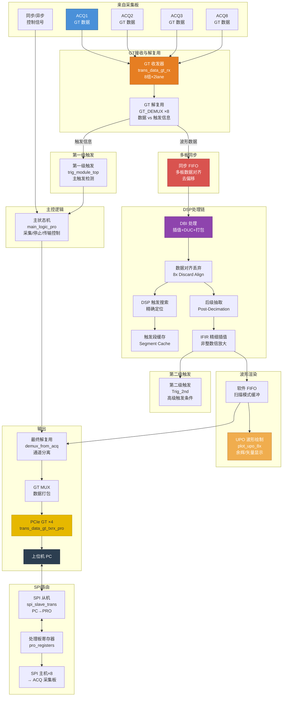

## 一、处理板整体定位

处理板（PRO）也是一块 **FPGA 板**（同样是 Xilinx VU9P），整个系统的层级是：

```
PC 上位机 (PCIe)
    ↕ PCIe ×4 lane (GT)
处理板 PRO_VU9P70000 (FPGA)
    ↕ GT ×2 lane ×8 组（共 16 对 GT）
采集板 ×8  ACQ_VU9P70000 (FPGA)
```

处理板扮演**中枢路由器 + 协处理器**的角色：
1. **数据汇聚**：接收来自最多 8 块采集板的 GT 高速数据
2. **DSP 处理**：同步 FIFO 对齐、DBI 插值、IFIR 插值、第二级触发检测
3. **UPO 波形绘制**：将数据渲染为屏幕像素（类似 GPU 的片段）
4. **SPI 路由**：将上位机的 SPI 命令转发给各采集板，汇总各采集板的返回数据
5. **PCIe 通信**：通过 PCIe ×4 GT 链路将最终波形数据发送给 PC

---

## 二、架构框图（Mermaid 流程图）



---

## 三、各模块功能详解

### 1. 时钟模块 (`clk_gen`)

| 属性 | 说明 |
|------|------|
| **作用** | 生成处理板所需的各种时钟 |
| **输入** | 50MHz 板载晶振、采集板随路时钟 (`adc_rx_clk`)、LA 参考时钟 |
| **输出** | 250MHz（命令时钟 `cmd_clk`）、200MHz（IDELAY 参考时钟）、50MHz（GT 参考时钟）、625MHz（LA 用） |

时钟系统与采集板类似，但额外引入了 8 路来自采集板的随路时钟 `adc_rx_clk_w[7:0]`，用于同步 FIFO 的写端口时钟——每个采集板的数据以各自独立的时钟写入同步 FIFO。

---

### 2. SPI 路由模块 (`spi_slave_trans`)

| 属性 | 说明 |
|------|------|
| **作用** | 对上（PC）作为 SPI 从机，对下（ACQ）作为 SPI 主机，实现 SPI 命令的路由转发 |
| **上行** | 接收来自 PC 的 SPI 帧（`cs/sck/mosi_from_pcie`），解析出地址和数据 |
| **下行** | 将 SPI 命令转发到 8 个采集板（`cs/sck/mosi_to_acq`），同时接收各采集板的返回数据（`miso_from_acq`） |
| **返回** | 汇总采集板返回的数据，通过 `miso_to_pcie` 返回给 PC |

**关键理解**：PC 上位机**不直接**和采集板通信。所有对采集板寄存器的读写都经过处理板的 SPI 路由模块中转。处理板根据地址范围判断：某些地址访问的是处理板自己的寄存器，另一些地址则需要转发给对应的采集板。

**参数** `ACQ_CARD_NUMBER = 8`：最多支持 8 块采集板。

---

### 3. 系统监控 (`sysmon_xadc`)

| 属性 | 说明 |
|------|------|
| **功能** | 监控处理板 FPGA 的温度、VCCINT、VCCAUX、VCCBRAM 电压 |
| **输出** | 4 个 16 位寄存器，上位机可读取 |

`Fan_ctrl_pwm`：PWM 风扇控制，通过 `fan_tach` 反馈转速，`fan_pwm` 输出调速信号。

---

### 4. GT 高速收发器接收 (`trans_data_gt_rx`)

| 属性 | 说明 |
|------|------|
| **作用** | 接收来自 8 块采集板的 GT 串行数据并恢复为并行数据 |
| **通道数** | 8 组 × 2 lane = 16 对 GT 收发器 |
| **每路输出** | 128 位并行数据（`GT_trans_dout`），对应 8 块采集板总输出 `128×8 = 1024 位` |

> **与采集板的对应**：采集板的 `trans_data_gt_tx` 发送 → 处理板的 `trans_data_gt_rx` 接收。这是双板之间的 GT 高速串行链路。

---

### 5. GT 解复用 (`GT_DEMUX ×8`)

| 属性 | 说明 |
|------|------|
| **作用** | 将每个采集板发来的 GT 数据拆分为两路：端口1（波形数据，24 位）和端口2（触发比较器信息，64 位） |
| **原因** | 采集板的 `GT_MUX` 时复用了两路数据：触发路径的 `byte_cmp_r/f` 和主数据路径的波形数据。处理板需要还原出这两路 |

代码中：
```verilog
GT_DEMUX u_ACQ_DEMUX(
    .data_sel_r    (gt_data_sel),      // 数据选择信号
    .data_out_1    (demux_acq_i_out),  // 端口1：波形数据 (12bit × 2ch)
    .data_out_2    (demux_acq_i_out_p2), // 端口2：触发比较信息 (64bit)
);
```

---

### 6. 同步控制与异步控制

处理板和采集板之间有两套控制通道：

| 通道 | 信号 | 方向 | 用途 |
|------|------|------|------|
| **同步通道** | `sync_ctrl_sig_from_acq` | ACQ→PRO | 触发地址（2bit）× 8 路、触发地址有效标志 × 8 路 |
| **同步通道** | `sync_ctrl_sig_to_acq` | PRO→ACQ | 同步复位 (`acq_sync_start`) + 触发地址 + 触发地址有效 |
| **异步通道** | `async_ctrl_sig_from_acq` | ACQ→PRO | 写完成、读使能、sysref 时钟 |
| **异步通道** | `async_ctrl_sig_to_acq` | PRO→ACQ | 接收端忙状态、读使能、ADC 数据使能、DSP/插值搜索使能、触发标志 |

```verilog
// PRO → 各 ACQ 的异步控制信号
assign async_ctrl_sig_to_acq1 = {dsp_or_interp_en_to_acq, rd_dso_tap_en, 
                                  reg_adc_data_en[0], gt_demux_receiver_busy[0]};
// 含义：bit3=DSP/插值搜索使能, bit2=读DSO TAP使能, 
//       bit1=ADC数据使能, bit0=接收端忙
```

同步控制信号通过 `Sync_Data_Ctrl_PRO` 模块的 ISERDES/OSERDES 电路实现高速串行传输（含 IDELAY 扫描校准）。

---

### 7. 多板同步 FIFO (`SYNC_FIFO_Top`)

| 属性 | 说明 |
|------|------|
| **作用** | 将来自 8 块不同采集板的波形数据对齐，消除板间延迟差异 |
| **原理** | 每个采集板写一个独立的 FIFO，当所有 FIFO 都有足够数据时才同时读出，实现多板数据同步 |
| **输出** | `data_out_sync_fifo`：8 通道 × 12 位 = 96 位对齐后的数据 |

这是多板系统中至关重要的模块。各采集板的写入完成时间（`wr_finish`）和控制信号的传播延迟不同，同步 FIFO 保证了不同采集板的数据在后续处理中严格对齐。

---

### 8. DBI 处理 (`dbi_top_pro_mix`)

| 属性 | 说明 |
|------|------|
| **作用** | 对同步后的数据做 DBI 插值 + 数据打包，与采集板的 `DBI_16G` 功能类似但在处理板侧执行 |
| **通道** | 8 个子通道输入，每个 12 位 |

---

### 9. 第一级触发 (`trig_module_top`)

| 属性 | 说明 |
|------|------|
| **作用** | 在处理板侧利用 GT 数据中的触发比较器信息（`byte_cmp_r/f`，来自采集板的触发路径）进行一级触发决策 |
| **输出** | `trigged_flag`（触发标志）、`cycle_write_stop`（采集周期结束）、`ddr_trig_addr`（DDR 触发地址）、`trig_dis_num`（触发丢弃数） |

**为什么处理板也要做触发？** 采集板的触发比较器输出 64 位边沿信息（`byte_cmp_r/f`）通过 GT 发送到了处理板。处理板的 `trig_module_top` 需要汇总所有采集板的触发信息（多板、多通道），做出最终的触发决策——即：**真正的触发决策逻辑在 PRO 侧**，ACQ 侧只是产生"候选触发"信息。

触发源选择 `reg_trig_source_sel_acq_pro` 决定用哪块采集板的哪个通道作为触发源。

---

### 10. 主状态机 (`main_logic_pro`)

| 属性 | 说明 |
|------|------|
| **作用** | 控制整个采集-停止-传输的状态机 |
| **状态** | Idle → Wait_Trig → Pre_Trig → Post_Trig → Wait_Read → Transmitting |
| **控制信号** | `rd_en_to_acq`（读使能送给采集板）、`upo_rd_en`（UPO 读使能）、`gt_data_sel`（GT 数据选择） |

这个状态机与采集板的 `main_logic` 是对应的——两板通过同步/异步控制信号协调工作。例如采集板写完成后通过 `wr_finish` 通知处理板，处理板通过 `rd_en_to_acq` 通知采集板开始读数。

---

### 11. 第二级触发 (`Trig_2nd`)

| 属性 | 说明 |
|------|------|
| **作用** | 在 IFIR 插值后的数据上执行高级触发条件检测 |
| **支持的触发类型** | 边沿、脉宽、斜率、矮脉冲（Runt）、窗口、间隔、超时、失落（Dropout）、码型、逻辑、建立/保持时间等 |
| **特点** | 处理板侧的 IFIR 插值后数据有更多采样点（高达非整数倍），触发精度更高 |

这是示波器的高级触发功能，不是简单的边沿检测，而是复杂的逻辑/时序条件判断。

---

### 12. DSP 处理链（与采集板类似但在 PRO 侧）

数据从同步 FIFO 出来后，经过与采集板几乎对称的 DSP 处理链：

| 步骤 | 模块 | 说明 |
|------|------|------|
| 8 通道并行转串行组 | 组合逻辑 | `dbi_fifo_12i96o_dout[7:0]`：8 组独立的数据流 |
| 数据对齐与丢弃 | `data_discare_8x_2chmode_top` ×8 | 每组独立丢弃触发点之前的数据 |
| 触发位置搜索 | `pos_search_triggered_parallel_top` ×8 | 在丢弃后的数据上精确搜索触发位置 |
| 触发段缓存 | `dsp_segment_cache_8x` ×8 | 缓存触发段数据 |
| 后级抽取 | `decimation_post_para_top` ×8 | 适配显示分辨率 |
| 12 位进 96 位出 FIFO | `fifo_96to12` ×8 | 从 96 位并行到 12 位串行 |
| IFIR 插值 | `Inter_IFIR_Top` | 非整数倍插值（与采集板相同） |
| 插值后触发搜索 | `pos_search_triggered` ×8 | 在插值后的数据上再次精确定位 |
| 插值后缓存丢弃 | `post_interp_cache_discard` ×8 | 丢弃插值后的多余数据 |
| 软件 FIFO | `soft_fifo_top` | 缓冲输出给 PCIe |

**为什么 PRO 侧还要做一遍 DSP？**

- 采集板侧做了第一轮 DSP（校准、抽取、插值），但数据可能来自多板，需要在对齐后统一处理
- 处理板侧有更完整的触发决策信息（多板汇总），可以做更精确的触发定位
- 处理板的 DMA/PCIe 发送速率受限，需要做最后的抽取和缓冲

---

### 13. UPO 波形绘制 (`plot_upo_8x`)

| 属性 | 说明 |
|------|------|
| **作用** | 将波形采样点渲染为屏幕像素，支持**数字余辉（Digital Persistence）**和**矢量显示** |
| **输入** | `upo_data`：12 位 × 8 通道并行数据 |
| **输出** | `pic_data`：32 位像素数据，通过 PCIe 发送给 PC |
| **核心算法** | 时域压缩（Decimation Column）：将大量采样点按列压缩，保留每列的最大/最小值（峰值检测）或累积统计（余辉） |

UPO 是示波器的**显示引擎**。它将高速采样数据（可能高达数 GSa/s）映射到有限的屏幕像素（通常 1000 列）。支持：
- **矢量显示**：保留波形的最大/最小值，不丢失窄脉冲
- **余辉显示**：按概率累积波形点在屏幕上的"亮度"，模拟模拟示波器的荧光屏效果

---

### 14. 最终解复用 (`demux_from_acq`)

| 属性 | 说明 |
|------|------|
| **作用** | 将多路处理后的数据分离为独立通道输出 |
| **输出** | `dmux_out_regular`（常规波形数据，32 位）、`dmux_out_dpo`（DPO 数据）、`dmux_out_fast`（快速数据） |

通道选择由 `reg_pro_linkdemux_select` 控制，可以灵活组合不同采集板的数据到不同输出通道。

---

### 15. PCIe GT 发送 (`trans_data_gt_txrx_pro`)

| 属性 | 说明 |
|------|------|
| **作用** | 将最终的波形/像素数据通过 PCIe GT 链路发送给上位机 PC |
| **通道数** | 4 lane GT（PCIe ×4 配置） |
| **位宽** | 256 位并行输入 |

经过 `GT_MUX` 打包后的数据（UPO 像素数据或常规波形数据）通过此模块发送。PC 端通过 PCIe 驱动程序接收数据，再由上层软件渲染到屏幕。

---

### 16. 处理板寄存器 (`pro_registers`)

| 属性 | 说明 |
|------|------|
| **作用** | 处理板自身的寄存器文件，存储处理板的所有配置参数 |
| **寄存器数** | 约 500+ 个寄存器，覆盖触发、DSP、UPO、GT、通道控制、监控等所有功能 |

与采集板 `acq_registers` 结构完全相同：case 语句实现地址译码，每个 16 位寄存器有一个唯一地址。

---

## 四、SPI 通信层次

```
┌──────────────────────────────────────────────────────────┐
│                    PC 上位机                              │
│            (通过 PCIe 接口发送 SPI 命令)                   │
└────────────────────┬─────────────────────────────────────┘
                     │ SPI（PCIe 桥接）
                     ▼
┌──────────────────────────────────────────────────────────┐
│              处理板 PRO（spi_slave_trans）               │
│                                                          │
│  ┌──────────────────────────────────────────────────┐   │
│  │  地址判断：                                       │   │
│  │  · 地址 0x000-0x3FF → pro_registers（处理板自身） │   │
│  │  · 地址 0x400-0x7FF → 转发给 ACQ1                │   │
│  │  · 地址 0x800-0xBFF → 转发给 ACQ2                │   │
│  │  · ...以此类推 8 块采集板                         │   │
│  └──────────────────────────────────────────────────┘   │
└────┬──────┬──────┬──────┬──────┬──────┬──────┬──────┬────┘
     │SPI   │SPI   │SPI   │SPI   │SPI   │SPI   │SPI   │SPI
     ▼      ▼      ▼      ▼      ▼      ▼      ▼      ▼
┌──────┐┌──────┐┌──────┐                         ┌──────┐
│ACQ1  ││ACQ2  ││ACQ3  │  ...                    │ACQ8  │
│寄存器││寄存器││寄存器│                         │寄存器│
└──────┘└──────┘└──────┘                         └──────┘
```

处理板不仅有自身的寄存器文件，还能作为 SPI 主设备访问所有采集板的寄存器。上位机看到的是一个**扁平地址空间**，处理板负责将地址映射到正确的目标（自身或某块采集板）。

---

## 五、完整数据流（从采集板到 PC）

```
┌─ 8块采集板 ──────────────────────────────────────────┐
│ ACQ1~8 各自：ADC → 增益 → 滤波 → 抽取 → 存储         │
│           → 通道融合 → DSP → DBI → GT 发送            │
│           → GT_MUX(数据 + 触发信息时分复用)            │
└────────────────────┬────────────────────────────────┘
                     │ GT ×16 lane (每 ACQ 2 lane)
                     ▼
┌─ 处理板 PRO ───────────────────────────────────────┐
│ ① GT 接收 (trans_data_gt_rx)                       │
│ ② GT 解复用 (GT_DEMUX ×8) → 波形数据 / 触发信息     │
│ ③ 同步 FIFO (多板数据对齐)                          │
│ ④ 第一级触发 (trig_module_top) → 触发决策            │
│ ⑤ DBI 处理                                         │
│ ⑥ DSP 链(丢弃→搜索→段缓存→抽取→插值→增益)           │
│ ⑦ 第二级触发 (Trig_2nd)                             │
│ ⑧ UPO 波形绘制 (像素渲染) / 常规数据传输             │
│ ⑨ 最终解复用 + MUX                                 │
│ ⑩ PCIe GT 发送 (4 lane, ~40Gbps)                   │
└────────────────────┬────────────────────────────────┘
                     │ PCIe ×4
                     ▼
               ┌──────────┐
               │  PC 上位机 │
               │ (显示波形) │
               └──────────┘
```

---

## 六、双板触发同步机制（核心时序）

这是整个系统最精妙的部分。一个完整的采集周期：

```
时间线 →

PRO: [Idle] ──→ [Wait_Trig] ────→ [收到触发信息] ──→ [Pre_Trig] ──→ [Post_Trig]
                  │                                              │
ACQ:          [持续写入DDR]    → [触发比较器检测到触发]           │
                  │                → 发送 byte_cmp 给 PRO          │
                  │                → PRO 做触发决策                 │
                  │                → PRO 通过 sync_ctrl 告知 ACQ    │
                  │                                              │
              [DDR 写停止] ←────── cycle_write_stop ──────────────┘
                  │
              [wr_finish 告知 PRO] ──→ PRO 检测所有 ACQ 写完成
                  │                         │
              [等待读命令] ←────── rd_en_to_acq ←────────────── PRO 发起读
                  │
              [通过 GT 发送数据] ──────────────────────────────→ PRO 接收 + DSP
                                                                       │
                                                                  [通过 PCIe 发送给 PC]
```

关键控制信号（以 ACQ1 为例）：

| 信号 | 方向 | 含义 |
|------|------|------|
| `sync_ctrl_sig_to_acq1` | PRO→ACQ | `bit[3]=rst`, `bit[2:1]=触发地址`, `bit[0]=地址有效` |
| `sync_ctrl_sig_from_acq` | ACQ→PRO | `bit[2:1]=触发地址`, `bit[0]=地址有效` |
| `async_ctrl_sig_to_acq1` | PRO→ACQ | `bit[3]=DSP搜索使能`, `bit[2]=DSO读`, `bit[1]=ADC使能`, `bit[0]=接收忙` |
| `async_ctrl_sig_from_acq` | ACQ→PRO | `bit[1]=读使能`, `bit[0]=写完成` |
| `async_ctrl_sig_to_acq1_sigend` | PRO→ACQ | `bit[1]=触发标志`, `bit[0]=读使能`（单独通道，时序关键） |

---

## 七、处理板与采集板模块对应关系

| 采集板 (ACQ) | 处理板 (PRO) | 对应关系 |
|-------------|-------------|---------|
| `GT_MUX` / `trans_data_gt_tx` | `trans_data_gt_rx` / `GT_DEMUX` | 发送 ↔ 接收 |
| `trig_cmp_mux` | `trig_module_top` | 触发比较 ↔ 触发决策 |
| `main_logic` | `main_logic_pro` | 采集状态机 ↔ 主控状态机 |
| `trigaddr_send_port` | `trigaddr_receive_port` | 发送触发地址 ↔ 接收触发地址 |
| `stream_fifo_128pto8p_top` | `SYNC_FIFO_Top` | 通道融合 ↔ 多板同步 |
| `DBI_16G` | `dbi_top_pro_mix` | DBI 处理 |
| `Inter_IFIR_Top` | `Inter_IFIR_Top` | IFIR 插值 |
| `acq_registers` | `pro_registers` | 寄存器文件 |
| `rx_spi_slave_trans` | `spi_slave_trans` | SPI 从机 ↔ SPI 路由 |