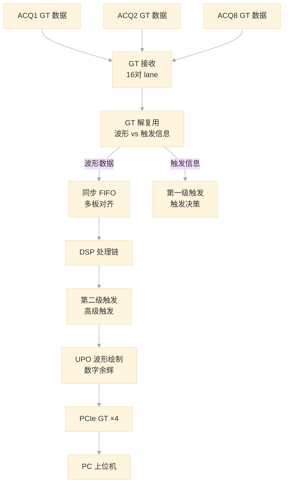

## 一、处理板定位

处理板同样是一块 FPGA 板，使用与采集板相同的芯片，**不是** PC 上位机。系统实际为三层：

```
PC 上位机 (PCIe ×4)
    ↕
处理板 FPGA (GT ×16, 接最多 8 块采集板)
    ↕
采集板 ×8 (每板 1 片 ADC)
```

处理板的核心职责：汇聚多块采集板的数据、做最终的触发决策、将波形渲染为屏幕像素、通过 PCIe 发送给 PC。

---

## 二、整体数据流



---

## 三、核心模块

### 1. 同步 FIFO——多板数据对齐

这是多板系统中最重要的模块。每块采集板独立写入各自的 FIFO，当所有板都有足够数据时才同时读出。各板的写入完成时间和控制信号传播延迟各不相同，同步 FIFO 确保数据在进入后续处理时严格对齐。

### 2. SPI 路由——PC 如何控制所有板卡

SPI 是一种四线制全双工同步串行总线（CS 片选、SCK 时钟、MOSI 主机发从机收、MISO 从机发主机收），主从架构。PC 上位机不直接与采集板通信——所有寄存器读写命令都发给处理板，处理板根据地址范围判断目标：低地址段对应自身的寄存器，高地址段转发给对应采集板，最后汇总返回数据一并回传。


### 3. 触发决策——两级触发的分工

这是笔记1中触发话题的延续，也是最体现系统设计思路的部分。

采集板的触发比较器只做硬件边沿检测，产生"候选触发"信息。处理板汇总所有采集板（多板、多通道）的边沿数据，结合触发源选择和触发模式配置，做出最终的触发决策。

**关键理解**：触发决策权在处理板侧。采集板只负责检测边沿，处理板决定用哪个通道、什么条件来触发。边沿触发、脉宽触发、协议触发、逻辑触发等完整触发逻辑实际执行在处理板上——采集板只是数据源和比较器前端。

### 4. 第二级触发——高级触发条件

在 IFIR 插值后的数据上执行高级触发条件检测。插值后采样点更多，触发精度更高。支持的触发类型包括：边沿、脉宽、斜率、矮脉冲（Runt）、窗口、间隔、超时、失落（Dropout）、码型、逻辑条件（与/或/非）、建立/保持时间等。

### 5. UPO 波形绘制——数字余辉

UPO（Ultra Power Oscilloscope）是示波器的显示引擎。将高速采样数据（GSa/s 级）映射到有限的屏幕像素（~1000 列）：

- **矢量显示**：每列保留最大/最小值，不会丢失窄脉冲
- **数字余辉**：波形点在每列的出现频率累积为亮度值，模拟模拟示波器的荧光屏效果

从 FPGA 角度看，UPO 模块类似于一个**时域压缩器**——输入是 GSa/s 的采样流，输出是适配屏幕分辨率（~MHz 级）的像素数据。

---

## 四、双板触发同步流程

一次完整的触发采集流程：

```
时间线 →

处理板: [空闲] → [等待触发] → [收到触发信息] → [预触发] → [后触发]
采集板:   [持续写入 DDR]  →  [触发比较器检测到触发]
            → 发送边沿检测结果给处理板
            → 处理板做出触发决策
            → 处理板通过同步通道告知采集板

采集板:   [DDR 写停止]
            → 写完成告知处理板

处理板:   [检测所有采集板写完]  →  发起读使能
采集板:   [收到读命令]  →  通过 GT 发送数据

处理板:   [接收数据 + DSP 处理]  →  PCIe 发送至 PC
```

两板之间通过两套物理通道协调工作：**同步通道**传输触发地址和复位等实时性要求高的信号（通过高速串行化和可编程延迟校准保证多板严格同步），**异步通道**传输写完成、读使能等状态标志。

---

