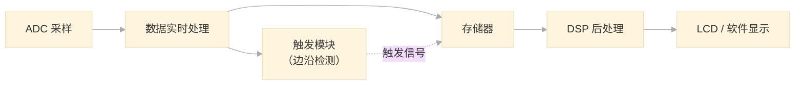

---

## 第一部分：采样数据存储与抽取技术

### 一、高速数据采集系统总体架构



- **信号链路**：ADC → 数据实时处理 → 存储器 → DSP → LCD / 软件处理
- **实际系统中还有两条路径**：
  - **触发路径**：用于实时检测触发事件，延迟极低，数据量小
  - **主数据路径**：用于完整波形的存储、处理和传输
- **关键模块**：触发模块、ADC 采样、数据实时处理与存储、显示输出

### 二、触发与存储基本概念

- **触发点**：波形采集的参考时刻
- **预触发深度**：触发点之前存储的采样点数
- **后触发深度**：触发点之后存储的采样点数
- **保持时间（Holdoff）**：避免重复触发的时间窗口，用于稳定非周期信号

注：硬件比较器只给出粗粒度的触发边沿检测结果，精确的触发位置需要在后续通过逐点搜索确定。

### 三、核心概念关系梳理

先理清几个关键概念，它们是理解整个存储系统的基础。假设 ADC 采样率固定为 **5 GSa/s**，屏幕水平 **1000 像素**（10 格 × 100 点/格）。

| 概念 | 一句话解释 | 由谁决定 |
|------|-----------|---------|
| **时基** | 屏幕上每格代表的时间 | 用户在面板上旋的（如 1μs/div） |
| **ADC 采样率** | 硬件采集速率 | 硬件固定，不变（如 5 GSa/s） |
| **存储前抽取** | 存进 DDR 前丢弃一些点 | 根据时基自动计算，保证带宽不超 |
| **存储采样率** | 实际写入 DDR 的数据速率 | = ADC 采样率 / 存储前抽取倍数 |
| **存储深度** | DDR 最大能存多少个点 | 硬件容量决定（如 100 Mpts） |
| **存储时间** | DDR 装满能录多长时间 | = 存储深度 / 存储采样率 |
| **存储后抽取** | DDR 读出来后再丢一些点 | 根据显示需求计算 |
| **显示采样率** | 屏幕显示的等效采样率 | = 屏幕像素数 / 全屏时间 |
| **记录长度** | 最终送到屏幕的点数 | 通常等于屏幕像素数（如 1000 点） |

**核心公式**：

```
总抽取倍数 = 存储前抽取 × 存储后抽取 = ADC 采样率 × 全屏时间 / 屏幕像素数
存储时间   = 存储深度 / 存储采样率 = 存储深度 × 存储前抽取倍数 / ADC 采样率
```

---

### 四、用一个例子串联所有概念

#### 快时基：1 μs/div

- 全屏时间 = 1 μs/div × 10 格 = **10 μs**
- ADC 产出 10 μs × 5 GSa/s = **50,000 个原始采样点**
- 屏幕只有 1000 像素 → 需要的显示采样率 = 1000 / 10 μs = **100 MSa/s**

此时 50,000 个点 DDR 完全存得下，所以存储前不抽取。读出时做 50 倍存储后抽取，把 50,000 个点变成 1000 个送显。

#### 慢时基：1 ms/div

- 全屏时间 = 1 ms/div × 10 格 = **10 ms**
- ADC 产出 10 ms × 5 GSa/s = **50,000,000 个原始采样点（5000 万）**

5000 万个点直接写 DDR 带宽扛不住，而且也没必要。所以**先做 1000 倍存储前抽取**：

- 存储采样率 = 5 GSa/s / 1000 = **5 MSa/s**
- 存进 DDR 的点 = 5 MSa/s × 10 ms = **50,000 个**
- 存储时间 = 100 Mpts / 5 MSa/s = **20 秒**（能录很久！）

此时 50,000 个点已经和屏幕匹配，读出后不用再抽取。

#### 小时基：1 ns/div（反过来需要插值）

- 全屏时间只有 **10 ns**
- ADC 只产出 10 ns × 5 GSa/s = **50 个原始采样点**
- 屏幕有 1000 像素，**点不够**——这时不做抽取，反而需要**插值**（正弦插值），在 50 个点之间插入估算点，补到 1000 个使波形平滑。

**规律**：用户旋时基 → 全屏时间变化 → 计算 ADC 产出点数与屏幕像素数的比值 → 比值 >1 就抽取，比值 <1 就插值。

---

### 五、信号抽取（Decimation）理论

- **抽取定义**：将采样频率减少 M 倍，即每 M 个点取 1 个
- **抽取的两种模式**：
  - **峰值检测**：取区间内最大/最小值，不丢失窄脉冲（示波器的核心特征）
  - **高分辨率**：取平均值，提高有效位数

---

### 六、数据抽取的实现方法

#### 6.1 串行数据抽取

控制 FIFO 写使能——根据抽取比例选择性地使能写信号。

#### 6.2 并行数据抽取

高速系统中 FPGA 接收的是多路并行数据。简单控制 FIFO 写使能会出现**非均匀抽点**，导致波形不光滑。解决方案：先抽取，再串并转换分配成所需路数。抽取后的多路数据通过异步 FIFO 做通道融合，同时完成跨时钟域转换。

---

## 第二部分：大容量存储技术

### 七、大容量存储核心问题

实际示波器通常采用**三级存储架构**应对不同时基需求：
- **Scan（扫描模式）**：不存储，直接流式输出，用于慢时基滚动显示
- **RAM（内部缓存）**：环形缓冲区，用于快时基触发捕获，延迟低
- **DDR（深存储）**：外部大容量内存，用于长时基和分段存储

### 九、普通存储 vs 深存储

| | 普通存储 | 深存储 |
|---|---|---|
| 存储时间 | 短（如 50ns） | 长（可达 ms 级） |
| 优势 | 延迟低 | 保持高采样率的同时获得长记录时间 |
| 局限 | 时间窗口小 | 需要大容量外部内存 |

深存储的典型工作方式：DDR 作为环形缓冲区，数据循环写入。触发后继续写一段（后触发深度），然后停止，按需读出处理。

---

### 十、等效捕获率

**问题**：示波器不是一直在抓波形的——两次采集之间有一段"死区时间"（处理数据、传输等）。用户关心的是：**平均每秒能捕获多少个波形？** 这就是等效捕获率（也叫波形捕获率）。

**核心公式**：$D_0 = T \cdot f \cdot N_{\max}$

| 符号 | 含义 | 说明 |
|------|------|------|
| $D_0$ | 等效捕获率 | 每秒最多捕获的波形帧数（单位：wfm/s，即 waveforms per second） |
| $T$ | 采集时间窗口 | 单次采集的时间跨度（= 存储深度 / 采样率） |
| $f$ | 触发频率 | 触发事件发生的频率 |
| $N_{\max}$ | 最大叠加次数 | 同一时间窗口内可叠加的波形帧数上限 |

简化为更直观的形式：

```
等效捕获率 ≈ 1 / (单次采集时间 + 死区时间)
```

其中**死区时间**包含：DDR 写入等待、数据从采集板读出并经过 GT 传输、处理板 DSP 处理、PCIe 向上位机发送等步骤。多板系统中，需等所有板写完才统一读取，最慢的那块板决定整体死区时间——这是制约多板系统捕获率的关键瓶颈。

---